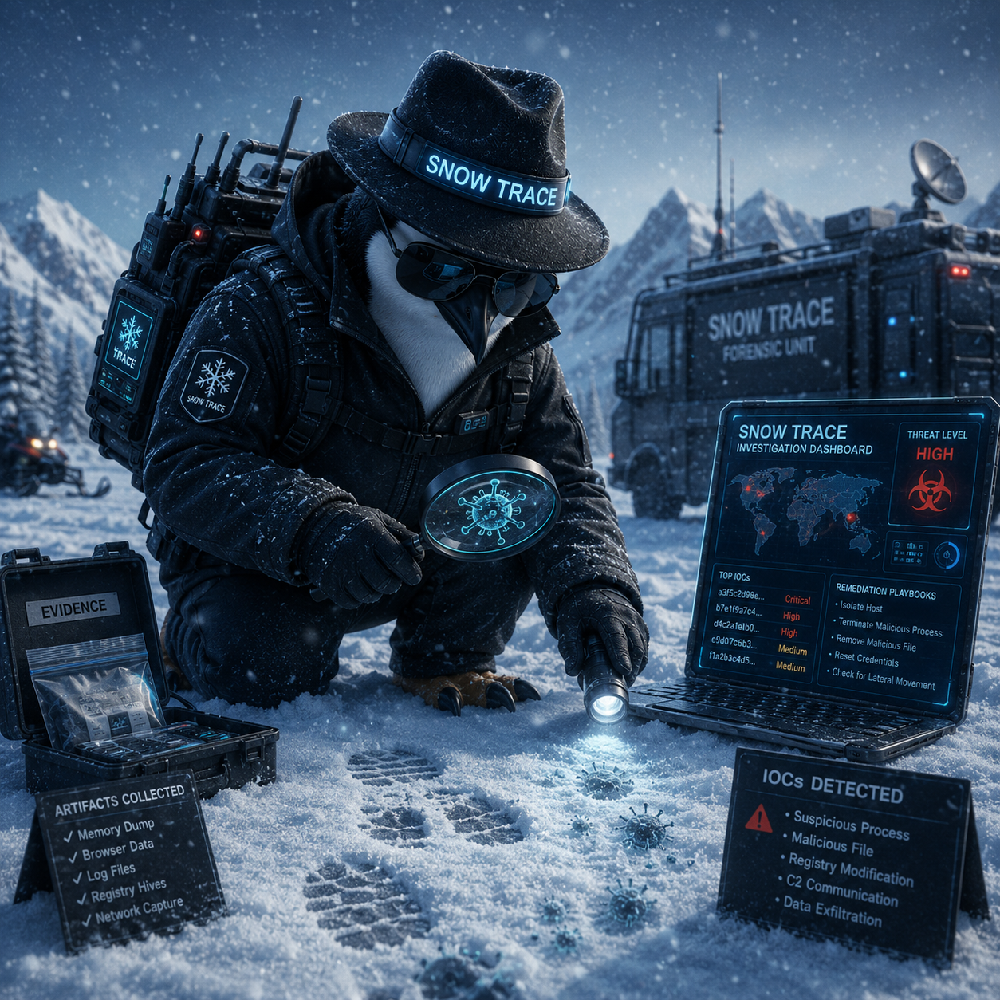

<p align="Center"> <b> SnowTrace </b></p>

<p align="center">
  
</p>

<p align="Center"> <b>Cyber triage toolkit for Windows and Linux incident response. </b></p>

<p align="center">
  <b>Version 1.0</b> · Created by <b>Agent P</b><br/>
SnowTrace collects forensic artifacts from a potentially compromised system and runs them through a browser-based analysis engine that flags indicators of compromise (IOCs), ranked by severity, with remediation playbooks for each finding.
</p>

---

<p align="center">
  <b>DISCLAIMER: This tool is for AUTHORIZED security testing and educational purposes ONLY.</b><br/>
  Unauthorized scanning of systems you do not own or have explicit written permission to test is
  illegal. Always obtain written authorization before conducting any tests.
</p>

---

## How It Works

```
Run script on target  →  Upload report to dashboard  →  Review findings  →  Follow remediation steps
```

1. **Download** the collection script for your platform from the dashboard
2. **Run** it on the target system (Administrator / root required for full results)
3. **Upload** the generated `.txt` report to the Analyze tab
4. **Act** on findings — the dashboard links each finding to a remediation playbook

All analysis runs entirely in the browser. No data leaves your machine.

---

## Features

| | |
|---|---|
| **15+ forensic check categories** | Processes, network, persistence, users, logs, and more |
| **60+ IOC detection rules** | Pattern-matched against collected artifacts |
| **4 severity levels** | CRITICAL · HIGH · MEDIUM · LOW · INFO |
| **Cross-platform** | Windows (PowerShell) and Linux (Bash) |
| **Zero dependencies** | No installs, no internet, no backend |
| **Remediation playbooks** | Step-by-step response guides per finding type |

---

## Requirements

| Platform | Requirements |
|---|---|
| **Windows** | PowerShell 5.0+, Administrator privileges |
| **Linux** | Bash, sudo / root access |
| **Dashboard** | Any modern browser (Chrome, Firefox, Edge) |

---

## Quick Start

### Windows

```powershell
# Run as Administrator
powershell -ExecutionPolicy Bypass -File snowtrace_windows.ps1
```

Output: `snowtrace_windows_HOSTNAME_YYYYMMDD_HHmmss.txt`

### Linux

```bash
# Run as root or with sudo
sudo bash snowtrace_linux.sh
```

Output: `snowtrace_linux_HOSTNAME_YYYYMMDD_HHmmss.txt`

### Analyze

Open `index.html` in a browser → go to the **Analyze** tab → drag and drop the report file.

---

## What It Detects

### Windows
- Processes running from `%TEMP%`, `AppData`, or other unusual paths
- Unsigned or tampered binaries
- Network connections to known attacker ports (4444, 31337, 6667, etc.)
- PowerShell abuse — `IEX`, `Invoke-Expression`, `-EncodedCommand`, `certutil`
- Base64-encoded payloads in command history
- Scheduled tasks using `mshta`, `regsvr32`, or `rundll32`
- WMI Event Subscription persistence
- Image File Execution Options (IFEO) debugger hijacking
- Failed login spikes and brute force indicators
- New or unexpected local user accounts
- Disabled Windows Defender

### Linux
- Processes spawned from `/tmp`, `/dev/shm`, `/var/tmp`
- Cron jobs with reverse-shell or download patterns (`wget`, `curl`, `nc`, `bash -i`)
- Suspicious SSH authorized keys
- Shell history with privilege escalation or lateral movement commands
- Root SSH login permitted (`PermitRootLogin yes`)
- SUID/SGID files outside standard system paths
- World-writable files in system directories
- Custom `/etc/hosts` entries
- Unexpected kernel modules (rootkit indicators)

---

## What Gets Collected

### Windows (15 categories)
System info · Running processes · Network connections · DNS cache · Scheduled tasks · Services · Persistence (registry, startup, WMI, IFEO) · User accounts · Security events · PowerShell config & history · Recently modified files · Installed software · Firewall rules · Windows Defender status · Suspicious indicators

### Linux (17 categories)
System info · Running processes · Network connections · DNS & hosts · Cron jobs · Startup services · User accounts · SSH config · Recently modified files · SUID/SGID files · World-writable files · Auth logs · Shell history · Kernel modules · Installed packages · Firewall rules · Suspicious indicators

---

## Dashboard Tabs

| Tab | Purpose |
|---|---|
| **Home** | Overview and 4-step workflow |
| **Download** | Get the collection scripts |
| **Analyze** | Upload and analyze a report |
| **How-To** | Step-by-step usage guide per platform |
| **Remediation** | Interactive playbooks for each finding type |
| **About** | Stack, credits, legal disclaimer |

---

## Tech Stack

**Collection scripts** — PowerShell 5.0+ (Windows), POSIX Bash (Linux)

**Dashboard** — HTML5, CSS3, Vanilla JavaScript · No frameworks, no dependencies · FileReader API for local file parsing · Blob URL for script downloads · HTML entity escaping throughout (XSS-safe)

---

## Legal Disclaimer

SnowTrace is intended for use on systems you own or are explicitly authorized to investigate. Unauthorized use against systems you do not have permission to access may violate computer crime laws. The authors are not responsible for misuse.

---

## Credits

Built by **Agent P**  
Version 1.0
